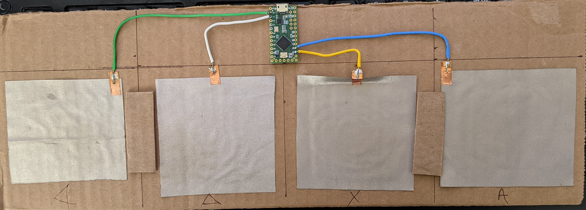
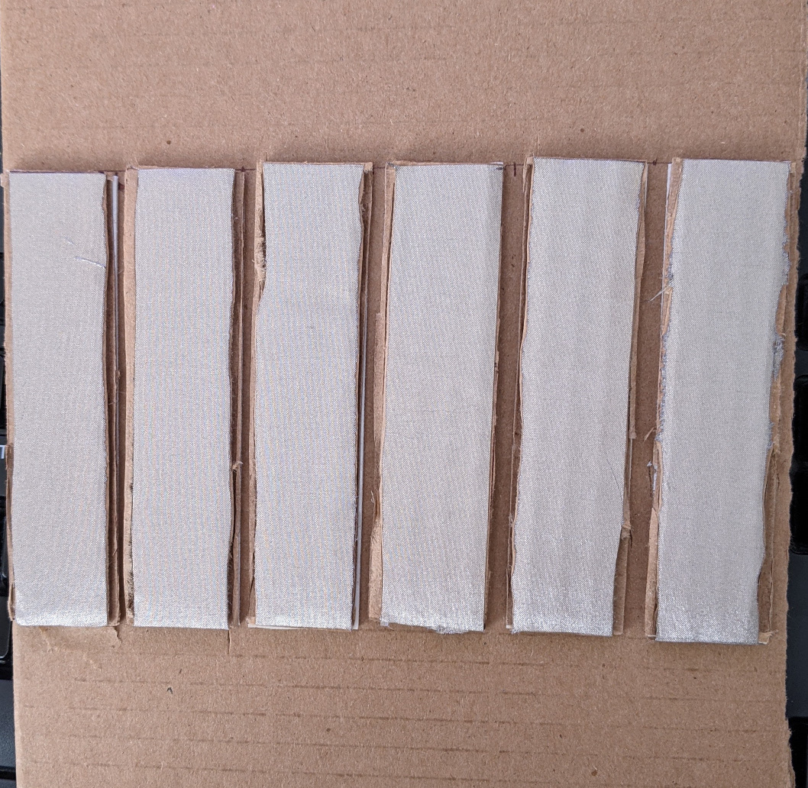

# USB Cardboard Dance Pad

The keyboard has four square keys made from conductive fabric glued to
cardboard. Each key has a small section of copper tape with conductive
adhesive. A short wire is soldered to the copper tape. The other end of the
wire is soldered to a capactive touch sensor on a PJRC Teensy LC board. The
board has 11 touch sensors so 6K and 8K games can be supported plus Enter,
Escape, etc.

This works fine as a four key beat pad but really is a mock-up for a dance pad.
Scale up to 1 x 1 foot conductive fabric squares. Go hard by gluing the fabric
to plastic or wood. Or go soft by sewing the squares to an old rug. This should
work for rhythm games that accept USB keyboard input such StepMania, DJMax,
Musynx, and Deemo.

This is a mock-up for a 6K cardboard piano. I thought about using it with
Deemo:Reborn but a MIDI keyboard is better.

The Arduino sketch scans the touch sensors. When touch is detected, the sketch
sends USB key presses for keyboard Left Arrow, Down Arrow, Up Arrow, and Right
Arrow. As far as the computer knows, it is talking to a USB keyboard so no
drivers are required. The keys can easily be changed to WASD or DFJK.

The copper tape and conductive fabric came from Amazon. The Teensy LC is from
pjrc.com.
